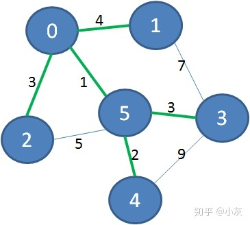

# 最小树


**————— 第二天 —————**


————————————


首先看看第一个例子，有下面这样一个带权图：


它的最小生成树是什么样子呢？下图绿色加粗的边可以把所有顶点连接起来，又保证了边的权值之和最小：


去掉那些多余的边，该图的最小生成树如下：


下面我们再来看一个更加复杂的带权图：


同样道理，下图绿色加粗的边可以把所有顶点连接起来，又保证了边的权值之和最小：





去掉那些多余的边，该图的最小生成树如下：


怎样铺设才能保证成本最低呢？


城市之间的交通网就像一个连通图，我们并不需要在每两个城市之间都直接进行连接，只需要一个最小生成树，保证所有的城市都有铁路可以触达即可。


Prim算法是如何工作的呢？


这个算法是以图的顶点为基础，从一个初始顶点开始，寻找触达其他顶点权值最小的边，并把该顶点加入到已触达顶点的集合中。当全部顶点都加入到集合时，算法的工作就完成了。Prim算法的本质，是基于**贪心算法**。


接下来说一说最小生成树的存储方式。我们最常见的树的存储方式，是链式存储，每一个节点包含若干孩子节点的指针，每一个孩子节点又包含更多孩子节点的指针：


这样的存储结构很清晰，但是也相对麻烦。为了便于操作，我们的最小生成树用一维数组来表达，数组下标所对应的元素，代表该顶点在最小生成树当中的父亲节点。（根节点没有父亲节点，所以元素值是-1）


下面让我们来看一看算法的详细过程：


**1.选择初始顶点，加入到已触达顶点集合。**


**2.从已触达顶点出发，寻找到达新顶点的权值最小的边。显然从0到2的边权值最小，把顶点2加入到已触达顶点集合，Parents当中，下标2对应的父节点是0。**


**3.从已触达顶点出发，寻找到达新顶点的权值最小的边。显然从2到4的边权值最小，把顶点4加入到已触达顶点集合，Parents当中，下标4对应的父节点是2。**


**4.从已触达顶点出发，寻找到达新顶点的权值最小的边。显然从0到1的边权值最小，把顶点1加入到已触达顶点集合，Parents当中，下标1对应的父节点是0。**


**5.从已触达顶点出发，寻找到达新顶点的权值最小的边。显然从1到3的边权值最小，把顶点3加入到已触达顶点集合，Parents当中，下标3对应的父节点是1。**


这样一来，所有顶点都加入到了已触达顶点集合，而最小生成树就存储在Parents数组当中。


```java
    final static int INF = Integer.MAX_VALUE;

    public static int[] prim(int[][] matrix) {
        List<Integer> reachedVertexList = new ArrayList<Integer>();
//选择顶点0为初始顶点，放入已触达顶点集合中
        reachedVertexList.add(0);
//创建最小生成树数组，首元素设为-1
        int[] parents = new int[matrix.length];
        parents[0] = -1;
//边的权重
        int weight;
//源顶点下标
        int fromIndex = 0;
//目标顶点下标
        int toIndex = 0;
        while (reachedVertexList.size() < matrix.length) {
            weight = INF;
//在已触达的顶点中，寻找到达新顶点的最短边
            for (Integer vertexIndex : reachedVertexList) {
                for (int i = 0; i < matrix.length; i++) {
                    if (!reachedVertexList.contains(i)) {
                        if (matrix[vertexIndex][i] < weight) {
                            fromIndex = vertexIndex;
                            toIndex = i;
                            weight = matrix[vertexIndex][i];
                        }
                    }
                }
            }
//确定了权值最小的目标顶点，放入已触达顶点集合
            reachedVertexList.add(toIndex);
//放入最小生成树的数组
            parents[toIndex] = fromIndex;
        }
        return parents;
    }

    public static void main(String[] args) {
        int[][] matrix = new int[][]{
                {0, 4, 3, INF, INF},
                {4, 0, 8, 7, INF},
                {3, 8, 0, INF, 1},
                {INF, 7, INF, 0, 9},
                {INF, INF, 1, 9, 0},
        };
        int[] parents = prim(matrix);
        System.out.println(Arrays.toString(parents));
    }
```


这段代码当中，图的存储方式是邻接矩阵，在main函数中作为测试用例的图和对应的邻接矩阵如下：


当然，也可以使用邻接表来实现prim算法，有兴趣的小伙伴可以尝试写一下代码。


